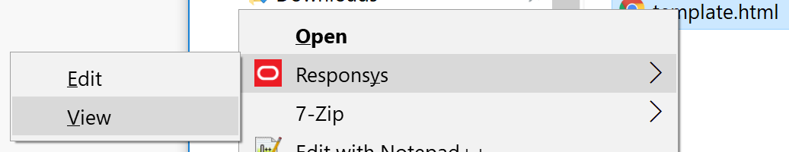

# orsys

CLI node app that let you to open an online htm/html file in Responsys editor or view window using a local file as path map.

## How to use

>**Note**: You must be already loggedin in Responsys.


### From CLI
Open a CLI windows in the file folder and run one of the following commands:

- View:
	```
	orsys filename.htm
	```
- Edit: 
	```
	orsys filename.htm -e
	```
	
### From Contextual menu
Rigth click any htm/html file to open the contextual menu, and click on ```Responsys\Edit``` to open this file responsys online counterpart.


## CLI options


```
Usage: orsys [options] <file>


Options:

	-e, --edit                   Open the file in edit an windows in Responsys
	-b, --browser <browserName>  (optional) the application to be used to open the file (for example, "chrome", "firefox")
	-h, --help                   output usage information
```


## Installation

```
npm install orsys -g
```

>**Note**: You must install this package globally to be able to use it anywhere.


### Contextual menu

On Windows you can optionaly install a contextual menu for htm/html files.

```
Add contextual menu for htm/html files? (Y/N)
```




## Setup

The tool expect a **orsys.json** configuration file next or in a upper folder to the file you want to open.

The config file must have a **root** property with the Responsys root folder you want to map in your local machine.

```
{
	"root" : "[PATH TO RSYS FOLDER]"
}
```


### Use Case

Take as reference this dummy folders tree:

#### Responsys dir tree
```
contentlibrary
 \--- 2015
 \--- 2016
 \--- 2017
		\--- campaign1
			shell.htm
		\--- campaign2
			shell.htm
		\--- campaign3
			shell.htm
```

#### Local dir tree
```
C:
 \--- Work
       \--- campaigns		
			\--- campaign1
				shell.htm
			\--- campaign2
				shell.htm
			\--- campaign3
				shell.htm
```

In this example we want to map all the local folders under **C:\Work\campaigns\** to the same name folders under RSYS folder **contentlibrary\2017**.

So, our RSYS _root_ folder will be: **2017** (as we exclude _contentlibrary_ since it will be automaticly added by the tool).

1. Create a **orsys.json** file on **C:\Work\campaigns**.
2. Add this code:
	```
	{
		"root" : "2017"
	}
	```

3. Now go to the folder **C:\Work\campaigns\campaign1**.
4. Right click on any htm/html file to open the contextual menu.
5. Click on **Responsys\Edit**.
6. A new tab will open on the default browser with the URL: https://interact2.responsys.net/interact/formcab/FileEdit?uid=contentlibrary/2017/campaign1/^shell.htm

